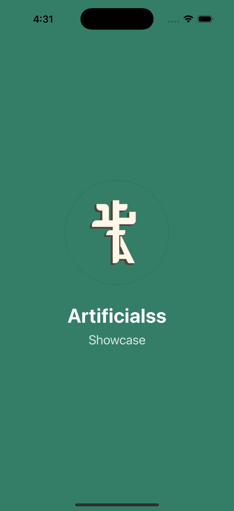
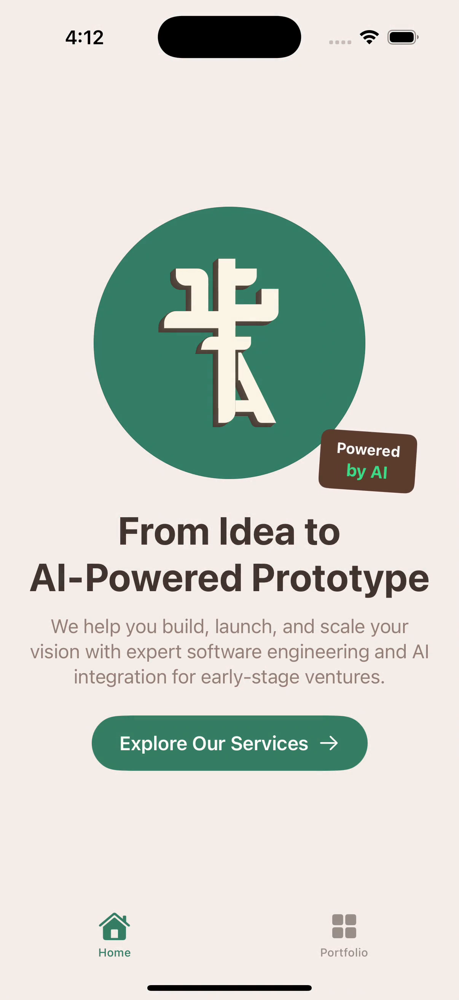
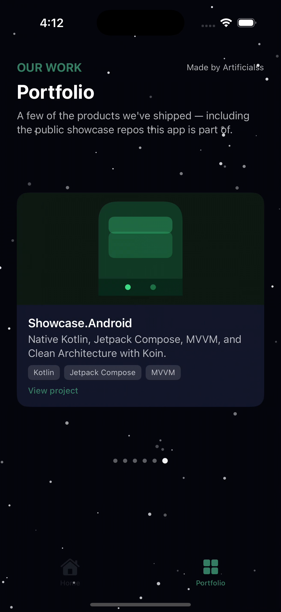
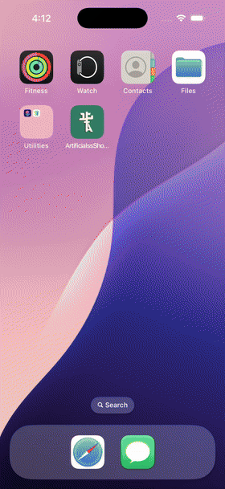

# Artificialss Showcase — iOS

[](LICENSE)
[](https://developer.apple.com/ios/)
[](https://swift.org)

A small, standalone native iOS app demonstrating our mobile engineering: **Swift + SwiftUI**, **MVVM with Clean
Architecture**, and the modern `@Observable` state pattern — the iOS counterpart to
[Showcase.Android](https://github.com/Artificialss/showcase-android).

It recreates the same Hero and Portfolio content shown on [Showcase.NextJS](https://github.com/Artificialss/showcase-nextjs),
adapted to native iOS conventions: a `TabView` bottom bar, a swipeable auto-advancing pager, and SF Symbols —
no backend, no credentials.

## Screenshots

| Splash | Home | Portfolio |
|--------|------|-----------|
|  |  |  |

## Demo

[](docs/screenshots/demo.mp4)

_Click the preview for the full-quality video._

## What's in here

A splash screen, then two tabs behind a native `TabView`:

- **Splash** — fades in the brand logo and tagline on the brand-green background, then auto-navigates to the
  main tabs.
- **Home** — logo with an animated "Powered by AI" sign, headline, subtitle, and a CTA button that opens
  [artificialss.ai/portfolio](https://artificialss.ai/portfolio) in the browser.
- **Portfolio** — a starry black-sky background with a page-style `TabView` that auto-advances every 3 seconds
  through 6 projects (including this repo itself), each with an illustrated Canvas mockup and a tap-through
  link to the real project.

## Architecture

Clean Architecture in three layers, MVVM on top — same shape as Showcase.Android's:

```
Domain/              # Pure Swift, zero UIKit/SwiftUI dependencies
├── Model/           # PortfolioItem
├── Repository/      # PortfolioRepository protocol
└── UseCase/         # GetPortfolioItemsUseCase

Data/                # Implementations
├── Mock/            # PortfolioMockGenerator — static project list, no backend
└── Repository/      # PortfolioRepositoryImpl

DI/                  # AppContainer — hand-rolled dependency container (Koin's Swift-native
                      # equivalent), one place wiring repository -> use case -> ViewModel

UI/                  # Presentation (MVVM)
├── Splash/          # SplashView — fade-in logo, auto-navigates to the main tabs
├── Home/            # HomeViewModel + HomeView
├── Portfolio/       # PortfolioViewModel + PortfolioView + Canvas mockups
├── Navigation/      # RootView — switches between Splash and the TabView
├── Theme/           # Brand color tokens ported from the Next.js/Android design system
└── Components/      # LogoView, SpaceBackgroundView
```

- **ViewModels use the `@Observable` macro** (not the older `ObservableObject`/`@Published` pattern) — the
  current recommended SwiftUI state-management approach, marked `@MainActor` since they're only ever touched
  from the UI.
- **No third-party DI framework.** `AppContainer` is a small, explicit factory — the Swift-native equivalent
  of the Koin module used on Android, without pulling in a dependency for something this simple.
- **The pager's own animation timing** (the 3-second auto-advance) lives in the View via a `.task` modifier —
  not in the ViewModel, since it's a UI/animation concern, not business logic.

## Tech Stack

| Layer | Technology |
|-------|-----------|
| Language | Swift 6 |
| UI | SwiftUI, iOS 17+ |
| State | `@Observable` (Observation framework) |
| Architecture | MVVM + Clean Architecture (Domain / Data / Presentation) |
| Project generation | [XcodeGen](https://github.com/yonaskolb/XcodeGen) — `project.yml` is the source of truth, `.xcodeproj` is generated and git-ignored |

## What's deliberately left out

No environment variables, API keys, analytics, or backend of any kind — the portfolio list is a static,
deterministic mock generator, matching the pattern used in the other Showcase.* repos. All external links open
in the system browser via SwiftUI's `openURL` environment action.

## Run it locally

Requires [XcodeGen](https://github.com/yonaskolb/XcodeGen) (`brew install xcodegen`):

```shell
xcodegen generate
open Showcase.xcodeproj
```

Then build and run the `Showcase` scheme on any iOS 17+ simulator or device.

## License

MIT — see [LICENSE](LICENSE). Free to use, modify, and distribute.

---

Built with SwiftUI by **Artificialss**
